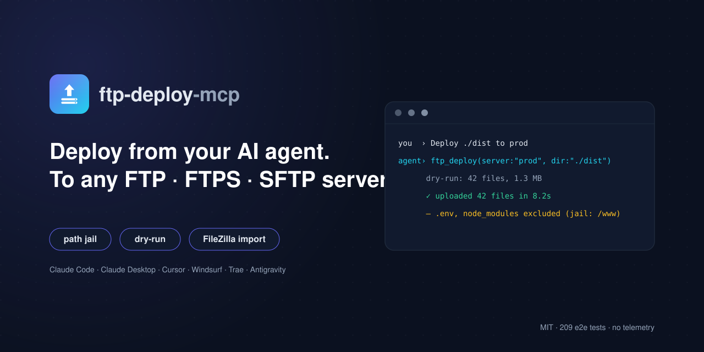
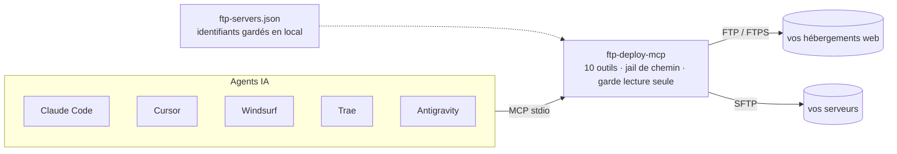

<div align="center">


# ftp-deploy-mcp

**Le bouton déployer pour les agents de codage IA.**
Claude Code · Claude Desktop · Cursor · Windsurf · Trae · Antigravity → vos propres serveurs FTP / FTPS / SFTP.

*English version → [README.md](./README.md)*

[](https://github.com/alebgl77/ftp-deploy-mcp/actions/workflows/ci.yml)
[](./LICENSE)
[](./package.json)
[](https://modelcontextprotocol.io)
[](./CONTRIBUTING.md)



</div>

<div align="center">



*Votre agent exécute le déploiement — vous n'avez qu'à demander.*

</div>

---

## Pourquoi

- Chaque projet web finit toujours pareil : **« il faut maintenant le mettre en ligne »**.
- Les agents IA écrivent très bien le code, mais la plupart n'ont aucun moyen sûr de le déployer sur un hébergement classique — OVH, Ionos, Hostinger, o2switch et le reste de l'hébergement mutualisé tournent toujours en FTP/SFTP, pas en `git push`.
- `ftp-deploy-mcp` donne à **n'importe quel client MCP** un chemin de déploiement vers votre propre infrastructure, dans la conversation même où le code a été écrit.
- Contrairement aux serveurs MCP génériques d'exécution SSH, celui-ci est conçu spécifiquement pour le déploiement de fichiers : un **jail de chemin**, un **mode lecture seule**, un **dry-run**, et des identifiants qui **ne transitent jamais par le contexte du modèle**.

## Fonctionnalités

| Fonctionnalité | Description |
|---|---|
| **Multi-serveurs** | FTP / FTPS / SFTP, autant de serveurs que vous voulez dans une seule config |
| **Déploiement en une commande** | Déploiement récursif d'un dossier, exclusions façon gitignore à toute profondeur, dry-run |
| **Jail de chemin** | Chaque opération est confinée sous un `root` propre à chaque serveur |
| **Mode lecture seule** | Bloque toute écriture sur les serveurs qui ne doivent jamais être modifiés |
| **Import FileZilla** | Convertit vos sites `sitemanager.xml` existants en une commande |
| **Auto-configuration** | Configure automatiquement 5+ clients MCP, avec sauvegardes horodatées |
| **Doctor** | Diagnostic en lecture seule de Node, de la config, des serveurs et du branchement client |
| **Zéro build** | JavaScript ESM pur — stdlib de Node + 5 petites dépendances |
| **Testé en conditions réelles** | 189 assertions e2e contre de vrais serveurs FTP + SFTP locaux |
| **Aucune télémétrie** | Rien ne quitte votre machine hormis les appels vers vos propres serveurs |

## Démarrage rapide

1. `git clone https://github.com/alebgl77/ftp-deploy-mcp.git && cd ftp-deploy-mcp`
2. Lancez **`install.cmd`** (double-clic, Windows) ou **`./install.sh`** (macOS / Linux).
3. Redémarrez votre IDE et demandez à votre agent : *« Déploie ./dist sur prod. »*

## Comment ça marche



---

## 1. Ce que c'est

Un serveur **MCP** (Model Context Protocol) qui tourne en `stdio` et expose 10 outils à
votre agent de codage. Les identifiants restent dans un fichier de configuration local :
**ils ne transitent jamais par le contexte du LLM**. Toutes les opérations distantes sont
confinées sous une racine (`root`) que vous choisissez par serveur.

Node.js **>= 18** requis. Aucune dépendance native à compiler.

---

## 2. Installation

### ⚡ Installation en 1 commande (recommandé)

```bash
git clone https://github.com/alebgl77/ftp-deploy-mcp.git
cd ftp-deploy-mcp
```

Puis lancez l'assistant :

- **Windows** : double-cliquez sur **`install.cmd`**.
- **macOS / Linux** : `./install.sh` (au besoin, `chmod +x install.sh` d'abord).
- **Ou manuellement** : `npm install && npm run setup`.

L'assistant `setup` fait tout à votre place :

- **construit ou importe** votre configuration de serveurs (y compris l'**import
  FileZilla** de vos sites existants) ;
- **teste les connexions** à chaque serveur ;
- **écrit automatiquement** les fichiers de configuration des clients MCP détectés
  (Claude Code, Claude Desktop, Cursor, Windsurf, Antigravity) — avec une
  **sauvegarde `.backup-<date>`** avant toute modification d'un fichier existant ;
- **affiche (et copie) un bloc à coller** pour Trae, dont la configuration se fait
  dans l'interface.

Ensuite, **redémarrez votre IDE**, puis demandez à votre agent, par ex.
« *Liste mes serveurs FTP* ».

### Diagnostic et options

À tout moment, un diagnostic **en lecture seule** (aucune écriture) :

```bash
npm run doctor          # ou : node src/index.js doctor
```

Il affiche la version de Node, quel fichier de config est utilisé, la liste des
serveurs (**jamais** les mots de passe) et, par client, si l'entrée `ftp` est bien
branchée sur cette installation.

Options de `setup` (`node src/index.js setup [options]`) :

| Option | Effet |
|--------|-------|
| `--yes` | Non-interactif (garde la config existante, ou importe avec `--from-filezilla`). |
| `--clients <all\|none\|id,id>` | Clients à configurer (défaut : tous ceux détectés). |
| `--from-filezilla [chemin]` | Importe depuis FileZilla (chemin optionnel → emplacement par défaut). |
| `--config-dest <chemin>` | Destination du fichier de config (défaut `~/.ftp-mcp/servers.json`). |
| `--skip-test` | Ne teste pas les connexions. |
| `--dry-run` | Affiche les actions prévues sans **rien** écrire. |
| `--force` | Remplace une entrée `ftp` déjà présente mais différente. |

### (b) Installation globale

```bash
npm install -g .
```

La commande `ftp-deploy-mcp` est alors disponible dans le `PATH` ; vous pouvez l'utiliser
à la place de `node .../src/index.js`.

### (c) Publication npm (pour un usage `npx -y`)

Si vous publiez ce paquet sur npm **sous votre propre nom**, vos clients pourront le lancer
sans installation :

```json
{ "command": "npx", "args": ["-y", "votre-nom-de-paquet"] }
```

---

## 3. Configuration des serveurs

Créez un fichier `ftp-servers.json`. Le serveur cherche la configuration dans cet ordre
(le premier trouvé gagne) :

1. `--config <chemin>` (argument de ligne de commande)
2. variable d'environnement `FTP_MCP_CONFIG` (chemin vers le JSON)
3. `./ftp-servers.json` (répertoire courant du processus)
4. `~/.ftp-mcp/servers.json`

### Schéma complet

```jsonc
{
  "defaultServer": "prod",          // optionnel : serveur utilisé si "server" n'est pas précisé
  "servers": {
    "prod": {
      "protocol": "sftp",           // REQUIS : "ftp" | "ftps" | "sftp"
      "host": "ssh.example.com",    // REQUIS
      "port": 22,                    // optionnel (défauts : ftp/ftps 21, sftp 22)
      "user": "deploy",             // REQUIS
      "password": "${ENV:PROD_PW}", // optionnel : mot de passe (ou placeholder d'env)
      "privateKeyPath": "~/.ssh/id_ed25519", // optionnel (sftp) : le "~" est étendu
      "passphrase": "…",            // optionnel : passphrase de la clé privée
      "root": "/var/www/site",      // optionnel (défaut "/") : TOUTES les opérations y sont confinées
      "readOnly": false,             // optionnel : bloque upload/deploy/mkdir/rename/delete
      "insecureTLS": false,           // optionnel (ftps) : accepte un certificat auto-signé
      "implicitTLS": false           // optionnel (ftps) : TLS implicite (port 990, serveurs legacy)
    }
  }
}
```

> Le fichier ci-dessus contient des commentaires `//` à titre pédagogique. Le **vrai**
> fichier doit être du **JSON strict** (sans commentaires). Voir
> [`ftp-servers.example.json`](./ftp-servers.example.json).

### Substitution de variables d'environnement

Toute valeur de type chaîne peut contenir `${ENV:NOM_DE_VARIABLE}`. Elle est remplacée par
la valeur de la variable d'environnement au démarrage. Si la variable est absente, l'outil
renvoie une erreur claire nommant la variable manquante.

```json
"password": "${ENV:OVH_FTP_PASSWORD}"
```

### Conseils de sécurité

- **Ajoutez `ftp-servers.json` à votre `.gitignore`** (c'est déjà le cas dans ce dépôt).
- Restreignez les droits du fichier (`chmod 600 ftp-servers.json` sous Unix).
- Privilégiez les **variables d'environnement** (`${ENV:…}`) ou une **clé SSH** plutôt
  qu'un mot de passe en clair.
- Utilisez `readOnly: true` pour les serveurs où l'agent ne doit jamais écrire.
- Fixez un `root` aussi étroit que possible : le jail empêche toute sortie via `../`.

---

## 4. Import depuis FileZilla

Vous avez déjà vos sites dans FileZilla ? Convertissez-les :

```bash
# Emplacement par défaut du sitemanager.xml détecté automatiquement…
node src/index.js import-filezilla

# …ou fichier explicite, écrit dans un ftp-servers.json
node src/index.js import-filezilla --file /chemin/sitemanager.xml --out ./ftp-servers.json
```

Sans `--out`, le JSON est imprimé sur la sortie standard. Les mots de passe stockés en
base64 sont décodés ; les sites sans mot de passe reçoivent un placeholder
`${ENV:<NOM>_PASSWORD}` (à définir vous-même). Exemple de sortie :

```json
{
  "defaultServer": "mon-site",
  "servers": {
    "mon-site": {
      "protocol": "ftp",
      "host": "ftp.example.com",
      "user": "deploy",
      "password": "…",
      "root": "/www/html"
    }
  }
}
```

> **Attention** : le fichier généré contient des mots de passe déchiffrés en clair —
> gardez-le hors du contrôle de version (`.gitignore`) et restreignez ses droits
> (`chmod 600`).

---

## 5. Branchement manuel (si vous n'utilisez pas `setup`)

> `npm run setup` écrit ces fichiers **automatiquement** (avec sauvegarde). Cette
> section n'est utile que si vous préférez tout brancher à la main.

Remplacez `/chemin/absolu/vers/ftp-deploy-mcp/src/index.js` par le chemin réel (les
slashs `/` fonctionnent aussi sous Windows). Si vous avez publié le paquet sur npm,
remplacez `"command": "node", "args": ["…/src/index.js"]` par
`"command": "npx", "args": ["-y", "votre-nom-de-paquet"]`.

> Les emplacements de fichiers ci-dessous sont les **emplacements par défaut** au moment
> de la rédaction ; les interfaces de ces produits évoluent, vérifiez dans leur
> documentation si besoin.

### Claude Code

Fichier `.mcp.json` à la racine du projet :

```json
{
  "mcpServers": {
    "ftp": {
      "command": "node",
      "args": ["/chemin/absolu/vers/ftp-deploy-mcp/src/index.js"]
    }
  }
}
```

Ou en une commande :

```bash
claude mcp add ftp -- node /chemin/absolu/vers/ftp-deploy-mcp/src/index.js
```

### Claude Desktop

- Windows : `%APPDATA%\Claude\claude_desktop_config.json`
- macOS : `~/Library/Application Support/Claude/claude_desktop_config.json`
- Linux : `~/.config/Claude/claude_desktop_config.json`

```json
{
  "mcpServers": {
    "ftp": {
      "command": "node",
      "args": ["/chemin/absolu/vers/ftp-deploy-mcp/src/index.js"]
    }
  }
}
```

### Cursor

`~/.cursor/mcp.json` (global) ou `.cursor/mcp.json` (projet) :

```json
{
  "mcpServers": {
    "ftp": {
      "command": "node",
      "args": ["/chemin/absolu/vers/ftp-deploy-mcp/src/index.js"]
    }
  }
}
```

### Windsurf

`~/.codeium/windsurf/mcp_config.json` :

```json
{
  "mcpServers": {
    "ftp": {
      "command": "node",
      "args": ["/chemin/absolu/vers/ftp-deploy-mcp/src/index.js"]
    }
  }
}
```

### Trae

Trae **n'a pas de fichier de config stable** : tout se fait dans l'interface. Panneau
de chat IA → Settings/engrenage → MCP → **Add** → **Configure Manually**, puis collez
(c'est le bloc que `setup` affiche et copie dans le presse-papiers) :

```json
{
  "mcpServers": {
    "ftp": {
      "command": "node",
      "args": ["/chemin/absolu/vers/ftp-deploy-mcp/src/index.js"]
    }
  }
}
```

### Antigravity

Selon la version, le fichier est l'un de :

- `~/.gemini/antigravity/mcp_config.json`
- variante : `~/.gemini/config/mcp_config.json`

```json
{
  "mcpServers": {
    "ftp": {
      "command": "node",
      "args": ["/chemin/absolu/vers/ftp-deploy-mcp/src/index.js"]
    }
  }
}
```

Vous pouvez aussi passer par le panneau MCP de l'agent (gestion des serveurs MCP) →
ajouter un serveur, avec la même structure.

---

## 6. Les 10 outils

Tous les chemins distants (`path`, `remote_path`, …) sont **relatifs au `root`** du serveur
et en style POSIX. Le paramètre `server` est toujours optionnel (voir la résolution ci-dessous).

| Outil | Paramètres | Description |
|-------|-----------|-------------|
| `ftp_list_servers` | *(aucun)* | Liste les serveurs configurés (protocole, hôte, port, root, lecture seule, type d'auth). Jamais de mot de passe. |
| `ftp_test` | `server?` | Se connecte, liste la racine, confirme le succès. |
| `ftp_list` | `server?`, `path?` | Liste un dossier distant (dossiers d'abord). |
| `ftp_read` | `server?`, `path`, `max_bytes?` | Lit un fichier texte (défaut 262144, max 1048576 octets). Refuse les fichiers binaires. |
| `ftp_upload` | `server?`, `local_path`, `remote_path?` | Téléverse un fichier, crée les dossiers parents. |
| `ftp_deploy` | `server?`, `local_dir`, `remote_dir?`, `include?`, `exclude?`, `dry_run?` | Déploie un dossier récursivement (une seule connexion), avec exclusions par défaut. `dry_run` fonctionne même sur un serveur en lecture seule (`readOnly`). |
| `ftp_download` | `server?`, `remote_path`, `local_path`, `overwrite?` | Télécharge un fichier ; refuse d'écraser sauf `overwrite: true`. |
| `ftp_mkdir` | `server?`, `path` | Crée un dossier (récursif). |
| `ftp_rename` | `server?`, `from_path`, `to_path` | Renomme ou déplace. |
| `ftp_delete` | `server?`, `path`, `recursive?` | Supprime un fichier ; un dossier exige `recursive: true`. Jamais la racine. |

**Résolution du serveur** : paramètre `server` explicite → `defaultServer` → s'il n'y a
qu'un seul serveur, celui-là → sinon erreur listant les noms disponibles.

**Exclusions par défaut de `ftp_deploy`** : `**/node_modules/**`, `**/.git/**`, `.env`,
`.env.*`, `*.log`, `.DS_Store`, `Thumbs.db`, `ftp-servers.json`, `**/.ftp-mcp/**` (vos globs
`exclude` s'y ajoutent ; `include` restreint aux fichiers correspondants). Les motifs sans
`/` s'appliquent à toute profondeur (comme `.gitignore`) : un `apps/api/.env` imbriqué est
exclu aussi.

---

## 7. Exemples de prompts

- « **Déploie `./dist` sur le serveur `prod`.** »
- « **Liste ce qu'il y a dans `/www` sur `ovh`.** »
- « **Récupère le `.htaccess` du serveur `prod` et montre-le moi.** »
- « **Fais un dry-run du déploiement de `./build` vers `/www`** pour voir ce qui partirait. »
- « **Renomme `index.old.html` en `index.html` sur `prod`.** »

---

## 8. Sécurité

- **Jail de racine** : chaque opération est normalisée puis vérifiée pour rester sous le
  `root` du serveur. Toute tentative de sortie (`../…`) est refusée, y compris quand le
  `root` est `/`.
- **Lecture seule** : `readOnly: true` bloque toute écriture (upload, deploy, mkdir,
  rename, delete) ; la lecture reste possible.
- **Identifiants hors du LLM** : les mots de passe, passphrases et clés ne sont jamais
  renvoyés dans la sortie des outils.
- **Aucune télémétrie**, aucune connexion sortante hormis vers vos propres serveurs.
- **Connexions par appel** : chaque outil ouvre une connexion, effectue l'opération et la
  ferme — pas de session persistante.

---

## 9. Dépannage

- **Timeout / connexion impossible (FTP)** : souvent le **mode passif** bloqué par un
  pare-feu. Vérifiez que les ports passifs de votre serveur sont ouverts.
- **Auth SFTP par clé** : renseignez `privateKeyPath` (le `~` est étendu) et, si la clé
  est chiffrée, `passphrase`. Vérifiez les droits de la clé.
- **FTPS auto-signé** : mettez `insecureTLS: true` pour accepter un certificat non vérifié
  (à réserver aux serveurs de confiance).
- **FTPS implicite (port 990)** : mettez `implicitTLS: true` (protocole `ftps`) pour les
  serveurs legacy qui chiffrent dès la connexion, sans commande `AUTH TLS`.
- **« aucun serveur configuré »** : le fichier n'a été trouvé à aucun des 4 emplacements.
  Créez `ftp-servers.json` ou passez `--config <chemin>` / `FTP_MCP_CONFIG=<chemin>`.
- **Le client ne voit pas les outils après `setup`** : **redémarrez complètement l'IDE**
  (fermez toutes les fenêtres, pas seulement le projet), puis vérifiez le branchement
  avec `npm run doctor`.
- **Le serveur démarre malgré une config invalide** : c'est voulu (les clients MCP
  n'aiment pas les serveurs qui meurent au démarrage). L'erreur exacte est affichée sur
  `stderr` au lancement et renvoyée à chaque appel d'outil.

---

## Développement

```bash
npm test          # lance le smoke test complet (FTP + SFTP locaux, aucun réseau externe)
node src/index.js --version
node src/index.js --help
```

## Contribuer

Les contributions sont bienvenues — voir [CONTRIBUTING.md](./CONTRIBUTING.md) (en anglais)
pour la configuration de développement, les principes du projet et la checklist de PR.

## Sécurité (signalement)

Vous avez trouvé une vulnérabilité ? Merci de **ne pas** ouvrir d'issue publique — voir
[SECURITY.md](./SECURITY.md) (en anglais) pour savoir comment la signaler en privé.

## Licence

MIT — voir [LICENSE](./LICENSE).
