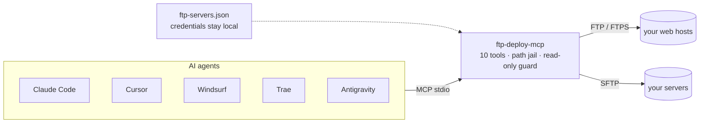

<div align="center">


# ftp-deploy-mcp

**The deploy button for AI coding agents.**
Claude Code · Claude Desktop · Cursor · Windsurf · Trae · Antigravity → your own FTP / FTPS / SFTP servers.

*Version française → [README.fr.md](./README.fr.md)*

[](https://github.com/alebgl77/ftp-deploy-mcp/actions/workflows/ci.yml)
[](./LICENSE)
[](./package.json)
[](https://modelcontextprotocol.io)
[](./CONTRIBUTING.md)


</div>

<div align="center">


*Your agent runs the deploy — you just ask.*

</div>

---

## Why

- Every web project ends the same way: **"now put it on the server."**
- AI agents write great code, but most have no safe way to ship it to classic hosting — OVH, Ionos, Hostinger, o2switch and the rest of the shared-hosting world still run on FTP/SFTP, not `git push`.
- `ftp-deploy-mcp` gives **any MCP client** a deploy path to your own infrastructure, in the same conversation where the code was written.
- Unlike generic SSH-exec MCP servers, this one is purpose-built for file deployment: a **path jail**, a **read-only mode**, **dry-run**, and credentials that **never enter the model's context**.

## Features

| Feature | Description |
|---|---|
| **Multi-server** | FTP / FTPS / SFTP, any number of servers in one config |
| **One-command deploy** | Recursive directory deploy, gitignore-like excludes at any depth, dry-run |
| **Path jail** | Every operation confined under a per-server `root` |
| **Read-only mode** | Block every write on servers that must stay untouched |
| **FileZilla import** | Convert your existing `sitemanager.xml` sites in one command |
| **Auto-setup** | Configures 5+ MCP clients automatically, with timestamped config backups |
| **Doctor** | Read-only diagnostic of Node, config, servers and client wiring |
| **Zero build** | Plain ESM JavaScript — Node stdlib + 5 small dependencies |
| **Battle-tested** | 189 e2e assertions against real local FTP + SFTP servers |
| **No telemetry** | Nothing leaves your machine except calls to your own servers |

## Quickstart

1. `git clone https://github.com/alebgl77/ftp-deploy-mcp.git && cd ftp-deploy-mcp`
2. Run **`install.cmd`** (double-click, Windows) or **`./install.sh`** (macOS / Linux).
3. Restart your IDE and ask your agent: *"Deploy ./dist to prod."*

## How it works



---

## 1. What it is

An **MCP** (Model Context Protocol) server that runs over `stdio` and exposes 10 tools to
your coding agent. Credentials live in a local config file and **never travel through the
LLM context**. Every remote operation is confined under a `root` you choose per server.

Requires Node.js **>= 18**. No native dependency to compile.

---

## 2. Installation

### ⚡ One-command install (recommended)

```bash
git clone https://github.com/alebgl77/ftp-deploy-mcp.git
cd ftp-deploy-mcp
```

Then launch the wizard:

- **Windows**: double-click **`install.cmd`**.
- **macOS / Linux**: `./install.sh` (run `chmod +x install.sh` first if needed).
- **Or manually**: `npm install && npm run setup`.

The `setup` wizard does everything for you:

- **builds or imports** your server configuration (including a **FileZilla import**
  of your existing sites);
- **tests the connection** to each server;
- **automatically writes** the config files of the detected MCP clients (Claude Code,
  Claude Desktop, Cursor, Windsurf, Antigravity) — with a **`.backup-<date>`** backup
  before modifying any existing file;
- **prints (and copies) a paste-ready block** for Trae, which is configured from its UI.

Then **restart your IDE** and ask your agent, e.g. "*List my FTP servers*".

### Diagnostics and options

At any time, a **read-only** diagnostic (writes nothing):

```bash
npm run doctor          # or: node src/index.js doctor
```

It prints the Node version, which config file is in use, the server list (**never**
passwords), and — per client — whether the `ftp` entry is wired to this install.

`setup` options (`node src/index.js setup [options]`):

| Option | Effect |
|--------|--------|
| `--yes` | Non-interactive (keeps the existing config, or imports with `--from-filezilla`). |
| `--clients <all\|none\|id,id>` | Clients to configure (default: all detected). |
| `--from-filezilla [path]` | Import from FileZilla (path optional → default location). |
| `--config-dest <path>` | Config file destination (default `~/.ftp-mcp/servers.json`). |
| `--skip-test` | Skip the connection tests. |
| `--dry-run` | Print the planned actions and write **nothing**. |
| `--force` | Replace an existing but different `ftp` entry. |

### (b) Global install

```bash
npm install -g .
```

The `ftp-deploy-mcp` command is now on your `PATH`; use it instead of
`node .../src/index.js`.

### (c) Publish to npm (for `npx -y` usage)

If you publish this package to npm **under your own name**, clients can run it with no
prior install:

```json
{ "command": "npx", "args": ["-y", "your-package-name"] }
```

---

## 3. Server configuration

Create an `ftp-servers.json` file. The server looks for it in this order (first found
wins):

1. `--config <path>` (command-line flag)
2. `FTP_MCP_CONFIG` environment variable (path to the JSON)
3. `./ftp-servers.json` (process working directory)
4. `~/.ftp-mcp/servers.json`

### Full schema

```jsonc
{
  "defaultServer": "prod",          // optional: used when "server" is not given
  "servers": {
    "prod": {
      "protocol": "sftp",           // REQUIRED: "ftp" | "ftps" | "sftp"
      "host": "ssh.example.com",    // REQUIRED
      "port": 22,                    // optional (defaults: ftp/ftps 21, sftp 22)
      "user": "deploy",             // REQUIRED
      "password": "${ENV:PROD_PW}", // optional: password (or an env placeholder)
      "privateKeyPath": "~/.ssh/id_ed25519", // optional (sftp); "~" is expanded
      "passphrase": "…",            // optional: private-key passphrase
      "root": "/var/www/site",      // optional (default "/"): ALL ops are jailed under it
      "readOnly": false,             // optional: blocks upload/deploy/mkdir/rename/delete
      "insecureTLS": false,           // optional (ftps): accept a self-signed certificate
      "implicitTLS": false           // optional (ftps): implicit TLS (port 990, legacy servers)
    }
  }
}
```

> The block above uses `//` comments for teaching only. The **real** file must be **strict
> JSON** (no comments). See [`ftp-servers.example.json`](./ftp-servers.example.json).

### Environment-variable substitution

Any string value may contain `${ENV:VARIABLE_NAME}`. It is replaced with the environment
variable's value at startup. If the variable is unset, tools return a clear error naming
the missing variable.

```json
"password": "${ENV:OVH_FTP_PASSWORD}"
```

### Security tips

- **Add `ftp-servers.json` to your `.gitignore`** (already done in this repo).
- Restrict the file permissions (`chmod 600 ftp-servers.json` on Unix).
- Prefer **environment variables** (`${ENV:…}`) or an **SSH key** over a plaintext
  password.
- Use `readOnly: true` for servers the agent must never write to.
- Set `root` as narrow as possible: the jail prevents any `../` breakout.

---

## 4. Import from FileZilla

Already have your sites in FileZilla? Convert them:

```bash
# Auto-detect the default sitemanager.xml location…
node src/index.js import-filezilla

# …or an explicit file, written to an ftp-servers.json
node src/index.js import-filezilla --file /path/sitemanager.xml --out ./ftp-servers.json
```

Without `--out`, the JSON is printed to stdout. Base64-encoded passwords are decoded; sites
without a stored password get a `${ENV:<NAME>_PASSWORD}` placeholder (you set the variable
yourself). Example output:

```json
{
  "defaultServer": "my-site",
  "servers": {
    "my-site": {
      "protocol": "ftp",
      "host": "ftp.example.com",
      "user": "deploy",
      "password": "…",
      "root": "/www/html"
    }
  }
}
```

> **Heads-up**: the generated file contains decoded plaintext passwords — keep it out of
> version control (`.gitignore`) and restrict its permissions (`chmod 600`).

---

## 5. Manual client setup (if you don't use `setup`)

> `npm run setup` writes these files **automatically** (with backups). This section
> is only useful if you'd rather wire everything by hand.

Replace `/absolute/path/to/ftp-deploy-mcp/src/index.js` with the real path (forward
slashes `/` also work on Windows). If you published the package to npm, swap
`"command": "node", "args": ["…/src/index.js"]` for
`"command": "npx", "args": ["-y", "your-package-name"]`.

> The file locations below are the **default locations** at the time of writing; these
> products' UIs evolve, so check their docs if needed.

### Claude Code

Project-root `.mcp.json`:

```json
{
  "mcpServers": {
    "ftp": {
      "command": "node",
      "args": ["/absolute/path/to/ftp-deploy-mcp/src/index.js"]
    }
  }
}
```

Or in one command:

```bash
claude mcp add ftp -- node /absolute/path/to/ftp-deploy-mcp/src/index.js
```

### Claude Desktop

- Windows: `%APPDATA%\Claude\claude_desktop_config.json`
- macOS: `~/Library/Application Support/Claude/claude_desktop_config.json`
- Linux: `~/.config/Claude/claude_desktop_config.json`

```json
{
  "mcpServers": {
    "ftp": {
      "command": "node",
      "args": ["/absolute/path/to/ftp-deploy-mcp/src/index.js"]
    }
  }
}
```

### Cursor

`~/.cursor/mcp.json` (global) or `.cursor/mcp.json` (project):

```json
{
  "mcpServers": {
    "ftp": {
      "command": "node",
      "args": ["/absolute/path/to/ftp-deploy-mcp/src/index.js"]
    }
  }
}
```

### Windsurf

`~/.codeium/windsurf/mcp_config.json`:

```json
{
  "mcpServers": {
    "ftp": {
      "command": "node",
      "args": ["/absolute/path/to/ftp-deploy-mcp/src/index.js"]
    }
  }
}
```

### Trae

Trae has **no stable config file** — everything is done in its UI. AI chat panel →
Settings/gear → MCP → **Add** → **Configure Manually**, then paste (this is the block
`setup` prints and copies to your clipboard):

```json
{
  "mcpServers": {
    "ftp": {
      "command": "node",
      "args": ["/absolute/path/to/ftp-deploy-mcp/src/index.js"]
    }
  }
}
```

### Antigravity

Depending on the version, the file is one of:

- `~/.gemini/antigravity/mcp_config.json`
- variant: `~/.gemini/config/mcp_config.json`

```json
{
  "mcpServers": {
    "ftp": {
      "command": "node",
      "args": ["/absolute/path/to/ftp-deploy-mcp/src/index.js"]
    }
  }
}
```

You can also use the agent's MCP panel (MCP server management) → add a server, with the
same structure.

---

## 6. The 10 tools

All remote paths (`path`, `remote_path`, …) are **relative to the server `root`** and use
POSIX style. The `server` parameter is always optional (see resolution below).

| Tool | Parameters | Description |
|------|-----------|-------------|
| `ftp_list_servers` | *(none)* | List configured servers (protocol, host, port, root, read-only, auth kind). Never a password. |
| `ftp_test` | `server?` | Connect, list the root, confirm success. |
| `ftp_list` | `server?`, `path?` | List a remote directory (directories first). |
| `ftp_read` | `server?`, `path`, `max_bytes?` | Read a text file (default 262144, max 1048576 bytes). Refuses binary files. |
| `ftp_upload` | `server?`, `local_path`, `remote_path?` | Upload one file, creating parent directories. |
| `ftp_deploy` | `server?`, `local_dir`, `remote_dir?`, `include?`, `exclude?`, `dry_run?` | Recursively deploy a directory over a single connection, with default excludes. `dry_run` works even on a read-only (`readOnly`) server. |
| `ftp_download` | `server?`, `remote_path`, `local_path`, `overwrite?` | Download a file; refuses to overwrite unless `overwrite: true`. |
| `ftp_mkdir` | `server?`, `path` | Create a directory (recursive). |
| `ftp_rename` | `server?`, `from_path`, `to_path` | Rename or move. |
| `ftp_delete` | `server?`, `path`, `recursive?` | Delete a file; a directory requires `recursive: true`. Never the root. |

**Server resolution**: explicit `server` parameter → `defaultServer` → the sole server if
there is only one → otherwise an error listing the available names.

**`ftp_deploy` default excludes**: `**/node_modules/**`, `**/.git/**`, `.env`, `.env.*`,
`*.log`, `.DS_Store`, `Thumbs.db`, `ftp-servers.json`, `**/.ftp-mcp/**` (your `exclude`
globs are added; `include` restricts to matching files). Slash-less patterns match at any
depth (gitignore-like): a nested `apps/api/.env` is excluded too.

---

## 7. Example prompts

- "**Deploy `./dist` to the `prod` server.**"
- "**List what's in `/www` on `ovh`.**"
- "**Fetch the `.htaccess` from `prod` and show it to me.**"
- "**Do a dry run of deploying `./build` to `/www`** so I can see what would be sent."
- "**Rename `index.old.html` to `index.html` on `prod`.**"

---

## 8. Security

- **Root jail**: every operation is normalized then verified to stay under the server
  `root`. Any breakout attempt (`../…`) is refused, even when `root` is `/`.
- **Read-only**: `readOnly: true` blocks every write (upload, deploy, mkdir, rename,
  delete); reads still work.
- **Credentials out of the LLM**: passwords, passphrases and keys are never returned in
  tool output.
- **No telemetry**, no outbound connection other than to your own servers.
- **Per-call connections**: each tool opens a connection, performs the op, and closes it —
  no persistent session.

---

## 9. Troubleshooting

- **Timeout / cannot connect (FTP)**: usually **passive mode** blocked by a firewall.
  Make sure your server's passive ports are reachable.
- **SFTP key auth**: set `privateKeyPath` (`~` is expanded) and, if the key is encrypted,
  `passphrase`. Check the key's permissions.
- **Self-signed FTPS**: set `insecureTLS: true` to accept an unverified certificate (only
  for servers you trust).
- **Implicit FTPS (port 990)**: set `implicitTLS: true` (`ftps` protocol) for legacy
  servers that encrypt from the first byte, without an `AUTH TLS` command.
- **"no server configured"**: the file was not found at any of the 4 locations. Create
  `ftp-servers.json` or pass `--config <path>` / `FTP_MCP_CONFIG=<path>`.
- **The client doesn't see the tools after `setup`**: **fully restart the IDE** (close
  every window, not just the project), then verify the wiring with `npm run doctor`.
- **The server starts despite an invalid config**: this is intentional (MCP clients
  dislike servers that die at startup). The exact error is printed on `stderr` at launch
  and returned on every tool call.

---

## Development

```bash
npm test          # runs the full smoke test (local FTP + SFTP, no external network)
node src/index.js --version
node src/index.js --help
```

## Contributing

Contributions are welcome — see [CONTRIBUTING.md](./CONTRIBUTING.md) for the dev setup,
the project's principles, and the PR checklist.

## Security

Found a vulnerability? Please **do not** open a public issue — see
[SECURITY.md](./SECURITY.md) for how to report it privately.

## License

MIT — see [LICENSE](./LICENSE).
